# JDM Culture

JDM Culture is a website dedicated to exploring the rich culture of Japanese Domestic Market (JDM) cars. It introduces users to the origins and evolution of JDM, its impact on tuning and street racing culture, and the iconic vehicles and figures that have defined the scene. From detailed timelines to legendary names and media influences, the site offers an engaging overview for both newcomers and enthusiasts. View the live site <a href="https://jacklamb99.github.io/jdm-culture/" target="_blank">here</a>.

## User Experience (UX)

### User Stories

The aim of this website was to provide an informative, visually engaging platform that introduces users to the world of Japanese Domestic Market (JDM) cars. The site was developed with a user-centred approach, ensuring it meets the needs of its intended audience through clear structure, accessible content, and responsive design.

Below are the user stories that guided the development process, along with explanations and visual examples of how each one was addressed.

### First-Time Visitor Goals

1. "As a first-time visitor, I want to see visually striking images of iconic Japanese cars, so I can immediately connect with the site’s theme and vibe."

    

Hero Image

    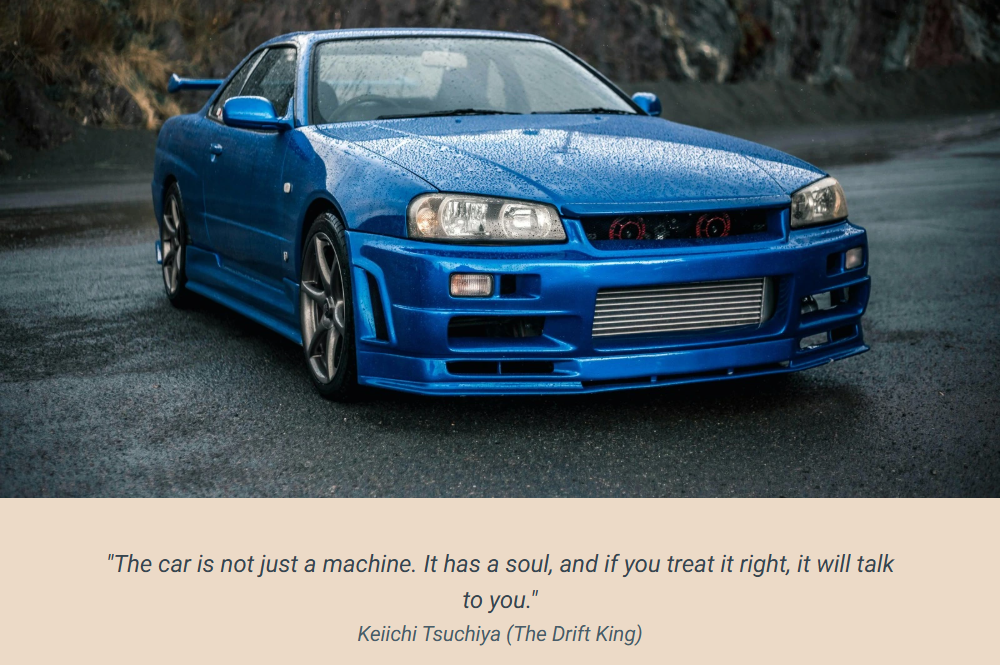

    

    Each main page opens with a bold hero image that highlights the JDM theme. These visuals are designed to grab attention and set the tone instantly. Different images are used for each device size, making the experience feel fresh and tailored across desktop, mobile, tablet, and ultra-wide screens.

2. "As a first-time visitor, I want to easily find the navigation menu and call-to-action buttons, so I can explore content without getting lost."

    

Navbar

    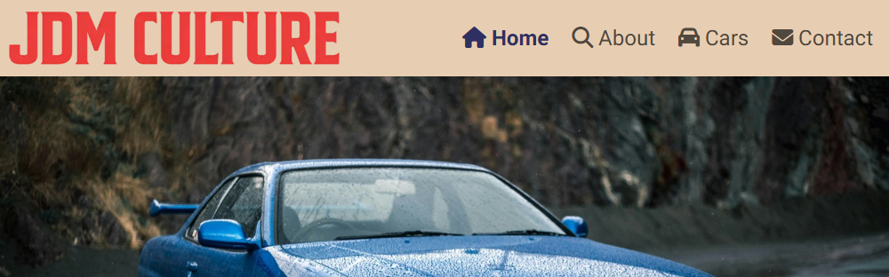

    

    

Navbar - Mobile

    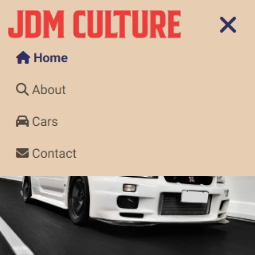

    

    

CTA Buttons

    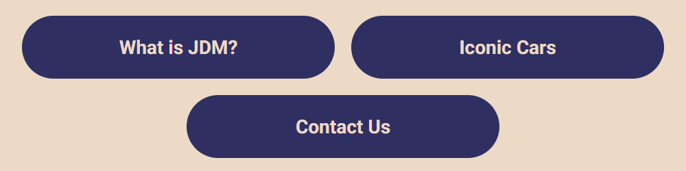

    

    The site features a clear, consistent navigation bar that's easy to spot and use. On smaller screens, it collapses into a responsive hamburger menu for smooth mobile navigation. Prominent call-to-action buttons on the landing page guide users to explore key content right away.

### Site User Goals

1. "As a site user, I want to explore content about the meaning and key aspects of JDM culture, so I can learn the basics without needing prior knowledge."

    

What is JDM?

    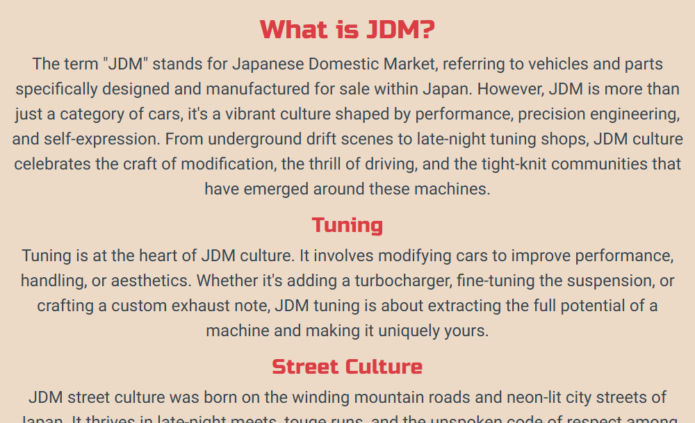

    

    The *About* page content opens with a clear *What is JDM* section that introduces the concept in simple terms. It's followed by a breakdown of key aspects like tuning, street culture, racing, and styling. This gives users an easy, accessible overview without needing any prior knowledge.

2. "As a site user, I want to explore content about the history of JDM culture and the people who helped shape it, so I can gain a greater appreciation for how it became what it is today."

    

The History of JDM

    

    

    

Legendary Names

    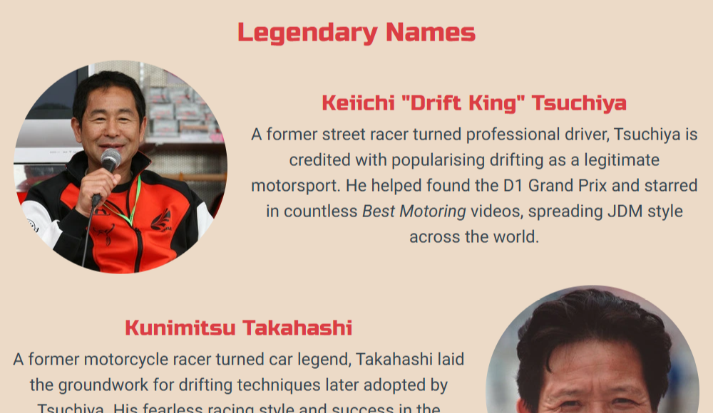

    

    The *History of JDM* section presents key moments in a timeline format, making it easy to follow the culture’s evolution. This is followed by the *Legendary Names* section, which highlights influential figures who shaped the scene and brought it global recognition.

3. "As a site user, I want to understand how JDM cars differ from international versions, so I can understand what makes them unique."

    

JDM vs Global Models

    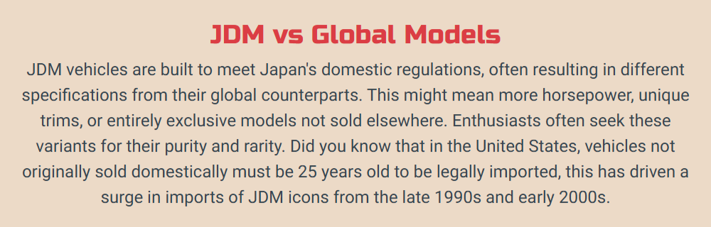

    

    The *JDM vs Global Models* section explains how Japanese-market cars differ from international versions, highlighting unique features, trims, and import restrictions. This helps users understand what sets JDM cars apart and why they’re so highly valued by enthusiasts.

4. "As a site user, I want to see how JDM culture has influenced films and games, so I can share these insights with friends or in online discussions."

    

Iconic Media Representation

    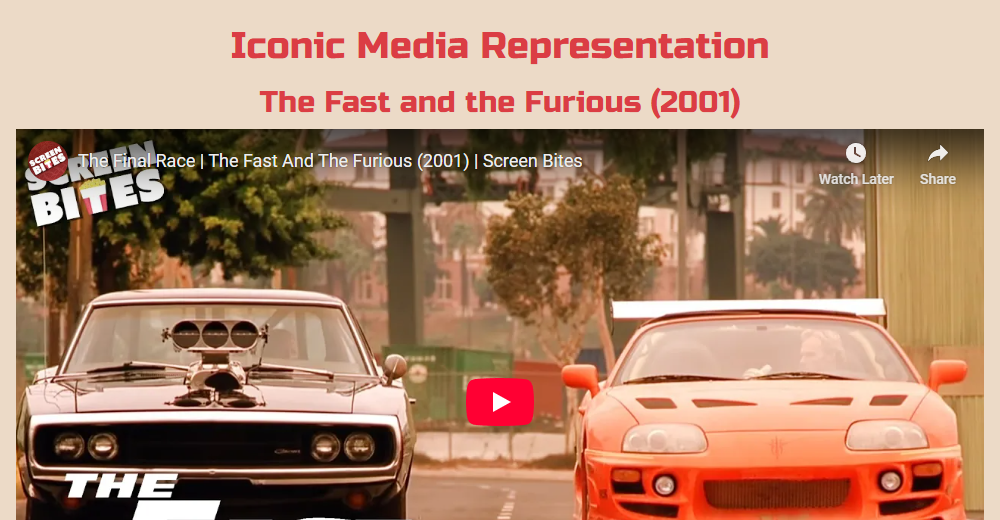

    

    The *Iconic Media Representation* section showcases how JDM culture has featured in popular films and games, with embedded clips and game visuals. Each includes a short explanation, making it easy for users to learn and share these cultural connections.

5. "As a site user, I want to find social media links easily, so I can follow the community and stay updated."

    

Social Links

    

    

    The site footer appears on every page and includes clearly visible social media icons. These provide easy access to the site's (hypothetical) social channels, helping users stay connected and follow updates.

### Frequent User Goals

1. "As a frequent user, I want to explore details and images about different cars, so I can deepen my knowledge of specific JDM vehicles I like."

    

Car Tiles

    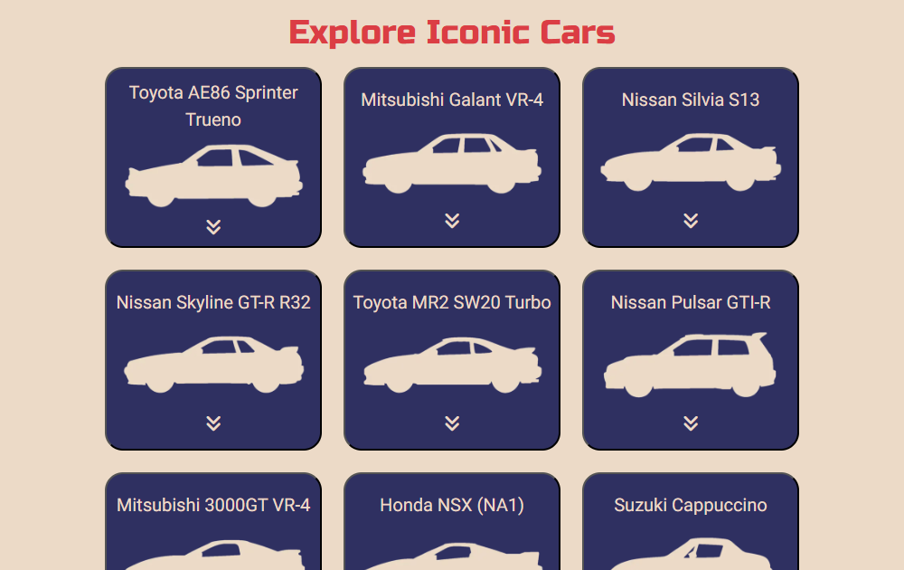

    

    

Car Modal

    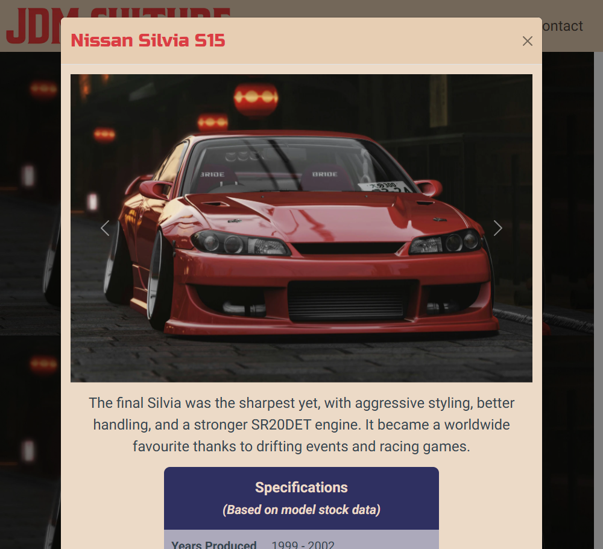

    

    The *Cars* page displays interactive tiles featuring car names, silhouette icons, and dropdown arrows. Clicking a tile opens a Bootstrap-powered modal with images and detailed information, allowing users to explore individual JDM vehicles in more depth.

2. "As a frequent user, I want to find accurate, clearly presented specs for each car, so I can compare models and use the site for reference."

    

Car Specs

    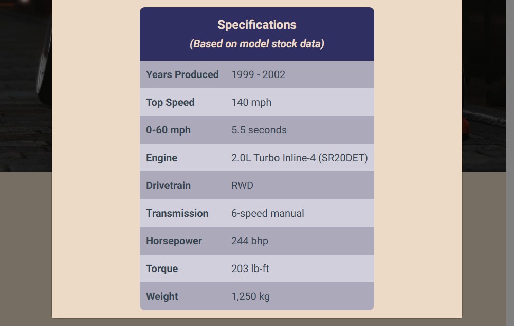

    

    Each car modal includes a clearly laid-out specifications table with accurate, detailed data. This makes it easy for users to compare models and use the site as a quick reference tool.

3. "As a frequent user, I want to contact the site owner to suggest features or corrections, so I can contribute to the growth and accuracy of the site."

    

Contact Form

    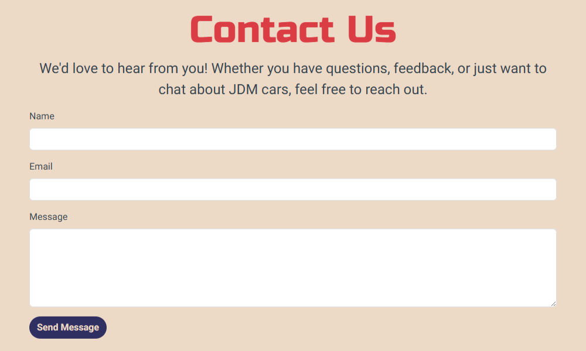

    

    

Thank You Page

    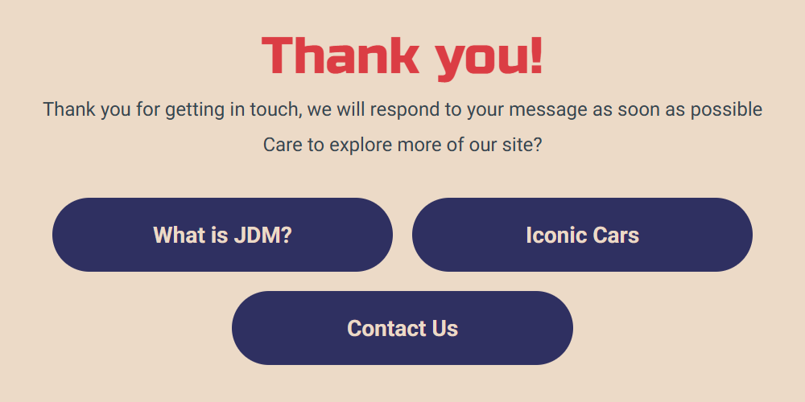

    

    The *Contact* page includes a simple form that allows users to send messages directly to the site owner. This encourages feedback, suggestions, and helps keep the site accurate and evolving. A custom *Thank You* page confirms the submission and offers call-to-action buttons to continue exploring the site.

4. "As a frequent user, I want to browse on mobile as smoothly as on desktop, so I can access the site on the go without readability or usability issues."

    

Responsiveness

    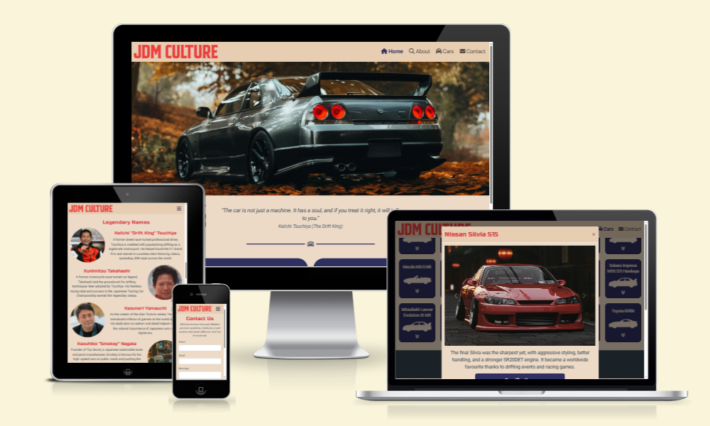

    

    The whole site is fully responsive, with layouts and content optimised for desktop, tablet, and mobile devices. This ensures a smooth, consistent browsing experience on the go, with no loss in readability or usability.

## Design

### Wireframes

The initial wireframes guided the site’s structure and layout across desktop and mobile devices.

Home Page Wireframe

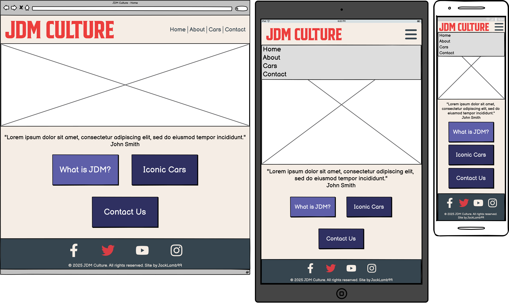

About Page Wireframe

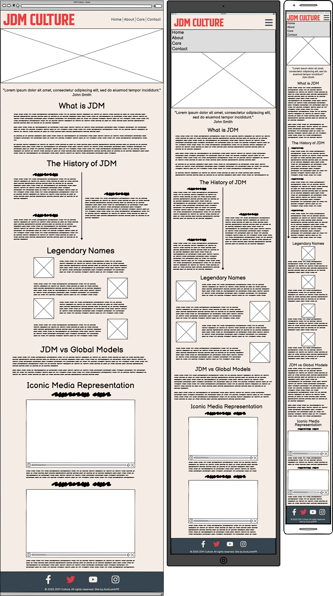

Cars Page Wireframe

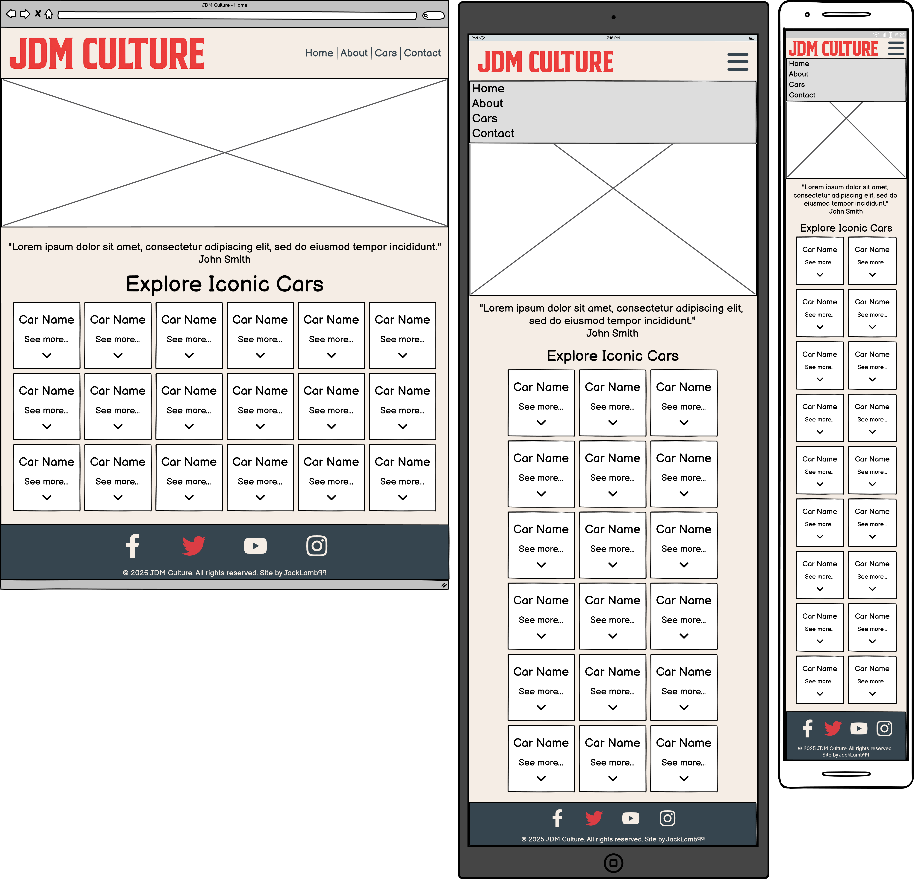

### Colour Palette

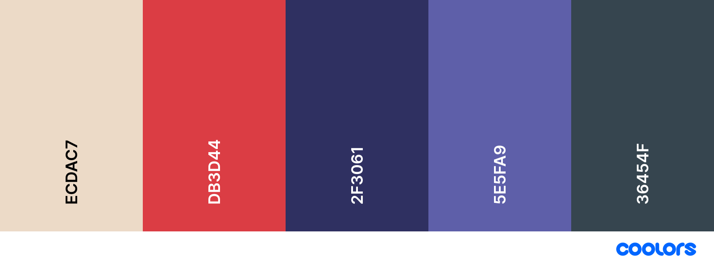

The colour scheme is inspired by vintage Japanese posters and car manuals, reinforcing cultural authenticity. A deep indigo and vivid red establish strong visual hierarchy, helping users focus on key elements, while muted tones and the 'linen' background colour reduce eye strain for longer reading sessions.

- Contrast and Legibility: The design uses light-on-dark and dark-on-light combinations that meet WCAG contrast guidelines for accessibility.
- Consistency: A limited but consistent palette is used across the site to reinforce a clear visual identity.
- Emotional Impact:
    - Red conveys excitement and speed — key elements of car culture.
    - Indigo represents technology and reliability.
    - Grey tones evoke modernity and balance the more vibrant accents.
- Focus: Accent colours are strategically used for CTA buttons, hover states, and navigation to guide the user’s attention.

### Imagery

All images aim to focus on JDM cars in real-world scenes to reflect the raw, energetic feel of JDM culture.

Some images were sourced from multiple sources due to limited availability of high-quality contextual imagery from free image providers. JDM Culture was made for an education project with no commerical value and all image credits are listed below.

### Typography

The site uses two fonts from Google Fonts to support both clarity and aesthetic impact:

- Russo One for headings: A bold, blocky display typeface that mirrors the strong, angular lines of classic JDM car design.
- Roboto for body text: A clean, modern sans-serif font optimised for readability on screens of all sizes.

This combination delivers contrast between structure and content, while maintaining a cohesive style across the site.

### User Interface

UI choices were made to enhance usability without distracting from content:

- Hover Effects: Interactive elements such as buttons, navigation links, and car tiles change shade on hover to give clear feedback.

    

Navbar Hover Effect

    

    

    

CTA Button Hover Effect

    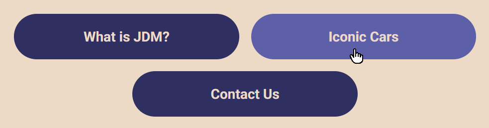

    

    

Section Divider Hover Effect

    

    

    

Cars Tiles Hover Effect

    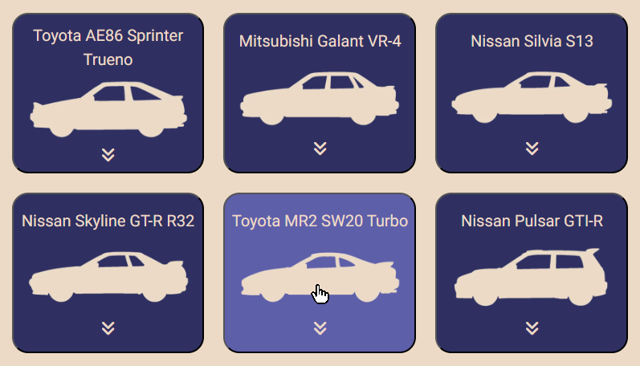

    

    

Social Links Hover Effect

    

    

- Modals: Car details are presented in Bootstrap-powered modals to keep users on the same page and reduce page load friction.
- Consistent Layouts: Spacing, font sizing, and padding remain consistent between sections across devices.
- Responsive Grids: Flexible layouts adapt seamlessly from desktop to mobile, maintaining hierarchy and clarity.