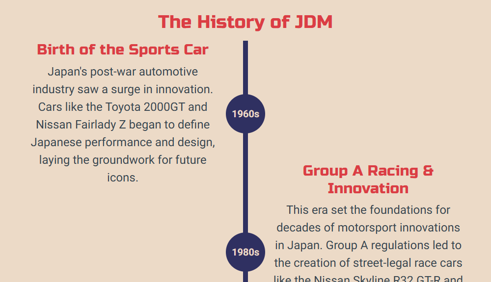
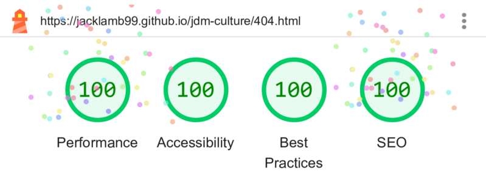

# JDM Culture

**JDM Culture** is a website dedicated to exploring the rich culture of Japanese Domestic Market (JDM) cars. It introduces users to the origins and evolution of JDM, its impact on tuning and street racing culture, and the iconic vehicles and figures that have defined the scene. From detailed timelines to legendary names and media influences, the site offers an engaging overview for both newcomers and enthusiasts. View the live site <a href="https://jacklamb99.github.io/jdm-culture/" target="_blank">here</a>.

## Table of Contents

- [User Experience (UX)](#user-experience-ux)
    - [User Stories](#user-stories)
    - [First-Time Visitor Goals](#first-time-visitor-goals)
    - [Site User Goals](#site-user-goals)
    - [Frequent User Goals](#frequent-user-goals)
- [Design](#design)
    - [Wireframes](#wireframes)
    - [Colour Palette](#colour-palette)
    - [Imagery](#imagery)
    - [Typography](#typography)
    - [User Interface](#user-interface-ui)
- [Testing](#testing)
    - [Compatibility and Responsiveness](#compatibility-and-responsiveness)
    - [Functional Testing](#functional-testing)
    - [Validation](#validation)
    - [Lighthouse](#lighthouse)
    - [Accessibility](#accessibility)
- [Technologies](#technologies)
- [Deployment](#deployment)
    - [Version Control](#version-control)
    - [Deployment to GitHub Pages](#deployment-to-github-pages)
    - [Cloning the Repository Locally](#cloning-the-repository-locally)
- [Credits](#credits)
    - [Tutorials](#tutorials)
    - [Code Used](#code-used)
    - [Media](#media)

## User Experience (UX)

### User Stories

The aim of this website was to provide an informative, visually engaging platform that introduces users to the world of JDM cars and culture. The site was developed with a user-centred approach, ensuring it meets the needs of its intended audience through clear structure, accessible content, and responsive design.

Below are the user stories that guided the development process, along with explanations and visual examples of how each one was addressed.

### First-Time Visitor Goals

1. "As a first-time visitor, I want to see visually striking images of iconic Japanese cars, so I can immediately connect with the site’s theme and vibe."

    

Hero Image

    

    

    Each main page opens with a bold hero image that highlights the JDM theme. These visuals are designed to grab attention and set the tone instantly. Different images are used for each device size, making the experience feel fresh and tailored across desktop, mobile, tablet, and ultra-wide screens.

2. "As a first-time visitor, I want to easily find the navigation menu and call-to-action buttons, so I can explore content without getting lost."

    

Navbar

    

    

    

Navbar - Mobile

    

    

    

CTA Buttons

    

    

    The site features a clear, consistent navigation bar that's easy to spot and use. On smaller screens, it collapses into a responsive hamburger menu for smooth mobile navigation. Prominent call-to-action buttons on the landing page guide users to explore key content right away.

### Site User Goals

1. "As a site user, I want to explore content about the meaning and key aspects of JDM culture, so I can learn the basics without needing prior knowledge."

    

What is JDM?

    

    

    The *About* page begins with a clear *What is JDM?* section that introduces the concept in simple terms. It's followed by a breakdown of key aspects like tuning, street culture, racing, and styling. This gives users an easy, accessible overview without needing any prior knowledge.

2. "As a site user, I want to explore content about the history of JDM culture and the people who helped shape it, so I can gain a greater appreciation for how it became what it is today."

    

The History of JDM

    

    

    

Legendary Names

    

    

    The *History of JDM* section presents key moments in a timeline format, making it easy to follow the culture’s evolution. This is followed by the *Legendary Names* section, which highlights influential figures who shaped the scene and brought it global recognition.

3. "As a site user, I want to understand how JDM cars differ from international versions, so I can understand what makes them unique."

    

JDM vs Global Models

    

    

    The *JDM vs Global Models* section explains how Japanese-market cars differ from international versions, highlighting unique features, trims, and import restrictions. This helps users understand what sets JDM cars apart and why they’re so highly valued by enthusiasts.

4. "As a site user, I want to see how JDM culture has influenced films and games, so I can share these insights with friends or in online discussions."

    

Iconic Media Representation

    

    

    The *Iconic Media Representation* section showcases how JDM culture has featured in popular films and games, with embedded clips and game visuals. Each includes a short explanation, making it easy for users to learn and share these cultural connections.

5. "As a site user, I want to find social media links easily, so I can follow the community and stay updated."

    

Social Links

    

    

    The site footer appears on every page and includes clearly visible social media icons. These provide easy access to the site's *(hypothetical)* social channels, helping users stay connected and follow updates.

### Frequent User Goals

1. "As a frequent user, I want to explore details and images about different cars, so I can deepen my knowledge of specific JDM vehicles I like."

    

Car Tiles

    

    

    

Car Modal

    

    

    The *Cars* page displays interactive tiles featuring car names, silhouette icons, and dropdown arrows. Clicking a tile opens a Bootstrap-powered modal with images and detailed information, allowing users to explore individual JDM vehicles in more depth.

2. "As a frequent user, I want to find accurate, clearly presented specs for each car, so I can compare models and use the site for reference."

    

Car Specs

    

    

    Each car modal includes a clearly laid-out specifications table with accurate, detailed data. This makes it easy for users to compare models and use the site as a quick reference tool.

3. "As a frequent user, I want to contact the site owner to suggest features or corrections, so I can contribute to the growth and accuracy of the site."

    

Contact Form

    

    

    

Thank You Page

    

    

    The *Contact* page includes a simple form that allows users to send messages directly to the site owner. This encourages feedback, suggestions, and helps keep the site accurate and evolving. A custom *Thank You* page confirms the submission and offers call-to-action buttons to continue exploring the site.

4. "As a frequent user, I want to browse on mobile as smoothly as on desktop, so I can access the site on the go without readability or usability issues."

    

Responsiveness

    

    

    The whole site is fully responsive, with layouts and content optimised for desktop, tablet, and mobile devices. This ensures a smooth, consistent browsing experience on the go, with no loss in readability or usability.

## Design

### Wireframes

The follwing wireframes guided the site’s structure and layout across desktop and mobile devices.

Index Page Wireframe

About Page Wireframe

Cars Page Wireframe

### Colour Palette

The colour scheme is inspired by vintage Japanese posters and car manuals, reinforcing cultural authenticity. A deep indigo and vivid red establish strong visual hierarchy, helping users focus on key elements, while muted tones and the *linen* background colour reduce eye strain for longer reading sessions.

- Contrast and Legibility: The design uses light-on-dark and dark-on-light combinations that meet WCAG contrast guidelines for accessibility.
- Consistency: A limited but consistent palette is used across the site to reinforce a clear visual identity.
- Emotional Impact:
    - Red conveys excitement and speed — key elements of car culture.
    - Indigo represents technology and reliability.
    - Grey tones evoke modernity and balance the more vibrant accents.
- Focus: Accent colours are strategically used for call-to-action buttons, hover states, and navigation to guide the user’s attention.

### Imagery

All images aim to focus on JDM cars in real-world scenes to reflect the raw, energetic feel of JDM culture.

JDM Culture was created as part of an educational project with no commercial value. Due to limited availability of high-quality contextual imagery from free image providers, some images were sourced elsewhere, all image sources are credited below.

### Typography

The site uses two fonts from Google Fonts to support both clarity and aesthetic impact:

- *Russo One* for headings: A bold, blocky display typeface that mirrors the strong, angular lines of classic JDM car design.
- *Roboto* for body text: A clean, modern sans-serif font optimised for readability on screens of all sizes.

This combination delivers contrast between structure and content, while maintaining a cohesive style across the site.

### User Interface (UI)

UI choices were made to enhance usability without distracting from content:

- Hover Effects: Interactive elements such as buttons, navigation links, and car tiles change shade on hover to give clear feedback.

    

Navbar Hover Effect

    

    

    

CTA Button Hover Effect

    

    

    

Section Divider Hover Effect

    

    

    

Car Tiles Hover Effect

    

    

    

Social Links Hover Effect

    

    

- Car Modals: Car details open in Bootstrap-powered modals, allowing users to stay on the same page and view content without additional page loads.
- Consistent Layouts: Spacing, font sizing, and padding remain consistent between sections across devices.
- Responsive Grids: Flexible layouts adapt seamlessly from desktop to mobile, maintaining hierarchy and clarity.

## Testing

### Compatibility and Responsiveness

All pages were tested in Google Chrome, Microsoft Edge, Mozilla Firefox, and Safari to ensure full responsiveness and compatibility with a range of screen sizes, including mobile and ultra-wide monitors. Tests were carried out in accordance with [WCAG 2.1 Reflow](https://www.w3.org/WAI/WCAG21/Understanding/reflow.html) standards.

#### Steps to test:

1. Open the browser and navigate to the JDM Culture website.
2. Open developer tools (right-click then Inspect).
3. Set the device to "Responsive" with width starting at 320px.
4. Zoom out to 50% to view full scaling on larger resolutions.
5. Drag the width toggle to test all breakpoints up to ultra-wide (2560px+).

**Expected Result**: No horizontal scroll, no overlapping elements, and all content remains readable and visually balanced.

**Actual Result**: The website responded as expected across all tested screen sizes and devices. No layout issues or scrollbars were detected.

#### Devices tested:

- Samsung Galaxy S20 mobile
- Apple iPhone 12 mobile
- Apple iPad Air tablet
- Google Chromebook laptop
- 1920×1080 desktop monitor

### Functional Testing

#### Navbar Links

Testing was performed to ensure all navbar links, including the site logo, correctly redirected users to the appropriate page.

| Link/Button | Expected Behaviour | Actual |
| - | - | - |
| Logo | Navigates to the Index page | Works as expected |
| Home | Navigates to the Index page | Works as expected |
| About | Navigates to the About page | Works as expected |
| Cars | Navigates to the Cars page | Works as expected |
| Contact | Navigates to the Contact page | Works as expected |

#### Footer Social Media Links

All social media icons in the site footer were tested to ensure they opened the correct platforms in a new tab.

| Icon | Expected Behaviour | Actual |
| - | - | - |
| TikTok | Opens TikTok in a new tab | Works as expected |
| Instagram | Opens Instagram in a new tab | Works as expected |
| Twitter | Opens Twitter in a new tab | Works as expected |
| YouTube | Opens YouTube in a new tab | Works as expected |

#### Footer GitHub Link

The *JackLamb99* text in the footer was tested to ensure it links to my GitHub page and opens in a new tab.

| Link | Expected Behaviour | Actual |
| - | - | - |
| *JackLamb99* Text | Opens https://github.com/JackLamb99 in a new tab | Works as expected |

#### Index Page CTA Buttons

Three call-to-action buttons are present on the Index page and were tested to ensure they correctly redirected users to the appropriate page.

| Button | Expected Behaviour | Actual |
| - | - | - |
| What is JDM? | Navigates to the About page | Works as expected |
| Iconic Cars | Navigates to the Cars page | Works as expected |
| Contact Us | Navigates to the Contact page | Works as expected |

#### Section Divider Buttons

The About page features section dividers with buttons that scroll the user to different content sections on the page.

| Button | Expected Behaviour | Actual |
| - | - | - |
| Up Arrow | Scrolls to the previous section | Works as expected |
| Down Arrow | Scrolls to the next section | Works as expected |
| Back to Top | Scrolls to the top of the About page | Works as expected |

#### Embedded YouTube Videos

Videos embedded in the Iconic Media section were tested to confirm they allow full playback control.

| Video | Expected Behaviour | Actual |
| - | - | - |
| The Fast and the Furious | Video plays, pauses, allows volume and fullscreen control | Works as expected |
| 2 Fast 2 Furious | Video plays, pauses, allows volume and fullscreen control | Works as expected |
| The Fast and the Furious: Tokyo Drift | Video plays, pauses, allows volume and fullscreen control | Works as expected |
| Baby Driver | Video plays, pauses, allows volume and fullscreen control | Works as expected |
| Initial D | Video plays, pauses, allows volume and fullscreen control | Works as expected |

#### Car Tiles and Modals

Car tiles were tested to ensure clicking them opens the corresponding modal with the correct information and allows modal closure.

| Element | Expected Behaviour | Actual |
| - | - | - |
| Car Tile Click | Opens modal with correct name, images, description, and specs table | Works as expected |
| Modal Close | Closes modal via "X" button or background click | Works as expected |

#### Contact Form Validation

Each field in the form on the Contact page was tested to ensure validation rules prevent submission with missing or invalid data.

| Field | Input | Expected Behaviour | Actual |
| - | - | - | - |
| Name | Empty | Form does not submit and error message shown | Works as expected |
| Email | Invalid/empty | Form does not submit and error message shown | Works as expected |
| Message | Empty | Form does not submit and error message shown | Works as expected |

#### Contact Form Submission

After filling in all required fields with valid data, the form was tested for proper submission and redirection.

| Action | Expected Behaviour | Actual |
| - | - | - |
| Submit | Redirects to the Thank You page | Works as expected |

#### Thank You Page CTA Buttons

Three call-to-action buttons are present on the Thank You page and were tested to ensure they correctly redirected users to the appropriate page.

| Button | Expected Behaviour | Actual |
| - | - | - |
| What is JDM? | Navigates to the About page | Works as expected |
| Iconic Cars | Navigates to the Cars page | Works as expected |
| Contact Us | Navigates to the Contact page | Works as expected |

#### 404 Page

The custom 404 page was tested by visiting an invalid URL to confirm that it loads and behaves correctly.

| Test | Expected Behaviour | Actual |
| - | - | - |
| Enter invalid URL | Displays custom 404 page | Works as expected |

#### 404 Page CTA Buttons

Four call-to-action buttons are present on the Thank You page and were tested to ensure they correctly redirected users to the appropriate page.

| Button | Expected Behaviour | Actual |
| - | - | - |
| Home | Navigates to the Index page | Works as expected |
| About | Navigates to the About page | Works as expected |
| Cars | Navigates to the Cars page | Works as expected |
| Contact | Navigates to the Contact page | Works as expected |

### Validation

#### HTML

No errors occurred when passing each page through the official [W3C Markup Validation Service](https://validator.w3.org/)

Index Page Validator Results

About Page Validator Results

Cars Page Validator Results

Contact Page Validator Results

Thank You Page Validator Results

404 Page Validator Results

#### CSS

No errors occurred when passing through the official [W3C CSS Validation Service](https://jigsaw.w3.org/css-validator/)

CSS Validator Results

### Lighthouse

Lighthouse was run in Google Chrome DevTools for all pages to assess Performance, Accessibility, Best Practices, and SEO.

Index Page Lighthouse Results

About Page Lighthouse Results

Cars Page Lighthouse Results

Contact Page Lighthouse Results

Thank You Page Lighthouse Results

404 Page Lighthouse Results

### Accessibility

[Wave Accessibility](https://wave.webaim.org/) tool was used to ensure all pages met the needs for any screen readers or accessibility aids for visually impaired users. Alt text was applied to all images, and interactive elements are keyboard-navigable where possible.

Index Page Wave Results

About Page Wave Results

Cars Page Wave Results

Contact Page Wave Results

Thank You Page Wave Results

404 Page Wave Results

## Technologies

The following technologies were used in the creation of the website:

- HTML5 - The structure of the website was built using semantic HTML.
- CSS3 - Custom CSS was used to style all pages and ensure consistent design.
- [Bootstrap 5](https://getbootstrap.com/) - Used for responsive layout, grid system, modals, and image carousels.
- [Visual Studio Code](https://code.visualstudio.com/) - The project was developed using the VS Code desktop application.
- [GitHub](https://github.com/) - The source code is hosted on GitHub and deployed using GitHub Pages.
- Git - Used for version control, including commits and pushing code throughout the development process.
- [Google Fonts](https://fonts.google.com/) - Used to import the 'Russo One' and 'Roboto' fonts for headings and body text.
- [Favicon.io](https://favicon.io/) - Used to convert and import the custom JDM Culture logo as a favicon.
- [Font Awesome](https://fontawesome.com/) - Used to find and import icons used throughout the website.
- [Balsamiq](https://balsamiq.com/wireframes/desktop/) - Wireframes were created using the Balsamiq desktop application.
- [Image Resizer](https://imageresizer.com/) - Used to resize images to optimise loading times and overall performance.
- [Free Convert](https://www.freeconvert.com/) - Used to convert all images to WEBP format for improved compression without quality loss.

## Deployment

### Version Control

The project was developed using the VS Code desktop application and pushed to the remote repository, [jdm-culture](https://github.com/JackLamb99/jdm-culture), on GitHub.

The following git commands were used throughout its creation to push code to the remote repository:

- `git add [file]` or `git add .` - This command was used to add the file(s) to the staging area before they were committed.
- `git commit –m "[commit message]"` - This command was used to commit changes to the local repository queue.
- `git push` - This command was used to push all committed code to the remote repository on GitHub.

### Deployment to GitHub Pages

The site was deployed to GitHub Pages, the steps to deploy are as follows:

1. In your GitHub repository, navigate to the Settings tab.
2. In the left-hand menu, click on Pages.
3. Under the Build and deployment section, select Deploy from a branch.
4. In the Branch dropdown, choose main (or the appropriate branch) and leave the folder set to `/ (root)` if it appears.
5. Click Save.
6. After a few moments, a live link to the deployed site will appear at the top of the page.
 *Note: You may need to refresh the page to see the link after saving.*

The live link can be found here - https://jacklamb99.github.io/jdm-culture/

### Cloning the Repository Locally

1. Open the GitHub repository you want to clone.
2. Click the green *Code* button under the repository name.
3. Under the HTTPS tab, click the copy icon next to the repository URL.
4. Open your IDE or terminal.
5. In the terminal, type the following command, replacing copied-url with the one you copied:
`git clone copied-url`
 *Note: Git must be installed on your system for this step to work. You can download it [here](https://git-scm.com/downloads).*

## Credits

### Tutorials

[Timeline Tutorial Video](https://youtu.be/t5AE66WgQD0?si=dCdXwgxVZEnqvu0_) - This video was followed but adapted and customised to make the responsive timeline used in the *History of JDM* section.

### Code Used

`<iframe>` code for videos in the *Iconic Media Representation* section copied from YouTube's 'Embed Video' tool.

### Media

Home Page Hero Images

- [Home Page Hero Image](https://www.pexels.com/photo/close-up-photo-of-blue-car-9846141/)
- [Home Page Hero Image - Mobile](https://unsplash.com/photos/white-car-AQuzzn6V6gE)
- [Home Page Hero Image - Wide](https://www.pexels.com/photo/back-view-of-a-gray-nissan-skyline-8060364/)

About Page Hero Images

- [About Page Hero Image](https://unsplash.com/photos/orange-porsche-911-parked-near-building-71MFodxIz8c)
- [About Page Hero Image - Mobile](https://unsplash.com/photos/black-honda-car-on-snow-covered-road-during-daytime-VfYP8Kk7xhU)
- [About Page Hero Image - Wide](https://unsplash.com/photos/white-coupe-parked-beside-brown-brick-building-during-daytime-4A0Z_FxXpVk)

Legendary Names Images

- [Keiichi Tsuchiya Image](https://en.wikipedia.org/wiki/Keiichi_Tsuchiya#/media/File:Keiichi_Tsuchiya_2008_Super_GT.jpg)
- [Kunimitsu Takahashi Image](https://www.motorsportimages.com/photos/driver/kunimitsu-takahashi/)
- [Kazunori Yamauchi Image](https://en.wikipedia.org/wiki/Kazunori_Yamauchi#/media/File:Festival_automobile_international_2015_-_Kazunori_Yamauchi_-_006.jpg)
- [Kazuhiko Nagata Image](https://apex-automotive.co.uk/smokey-nagata/)
- [Daijiro Inada Image](https://www.speedhunters.com/2011/01/behind_the_scenes_gt_interview_daijiro_inada/)

Iconic Media Representation Videos/Images

- [The Fast and the Furious Video](https://youtu.be/L_Cb1OepkY8?si=XXXEYI0DHcVdrZRs)
- [2 Fast 2 Furious Video](https://youtu.be/Vf50UQl2IJs?si=ew9960I9ih2_j_jG)
- [The Fast and the Furious: Tokyo Drift Video](https://youtu.be/6G-HIIYz3Fc?si=KtoupKPlzlE7UAyz)
- [Baby Driver Video](https://youtu.be/6XMuUVw7TOM?si=2pyh5hJsQTFSZQpf)
- [Initial D Video](https://youtu.be/wCiFKG0ZJ9I?si=A6-p7CSh7K895UFK)
- [Gran Turismo Image](https://www.timeextension.com/guides/best-gran-turismo-games-ranked-by-you)
- [Need for Speed: Underground 2 Image](https://nfs.fandom.com/wiki/Need_for_Speed:_Underground_2?file=NFSU2_Boxart.jpg)

Cars Page Hero Images

- [Cars Page Hero Image](https://unsplash.com/photos/a-red-car-parked-in-front-of-a-tall-building-mOeZ_Ma3fMs)
- [Cars Page Hero Image - Mobile](https://www.pexels.com/photo/a-red-subaru-impreza-on-a-street-20541144/)
- [Cars Page Hero Image - Wide](https://www.pexels.com/photo/brown-nissan-silvia-on-the-road-6894425/)

Car Modal Images

Toyota AE86 Sprinter Trueno Images

- [Toyota AE86 Sprinter Trueno First Image](https://www.pexels.com/photo/toyota-sprinter-trueno-16284885/)
- [Toyota AE86 Sprinter Trueno Second Image](https://www.pexels.com/photo/red-toyota-sprinter-trueno-19963421/)
- [Toyota AE86 Sprinter Trueno Third Image](https://www.pexels.com/photo/toyota-ae86-parked-on-a-car-show-14065247/)

Mitsubishi Galant VR-4 Images

- [Mitsubishi Galant VR-4 First Image](https://www.topgear.com/car-news/motorsport/classified-week-mitsubishi-galant-vr-4-rally-car)
- [Mitsubishi Galant VR-4 Second Image](https://www.speedhunters.com/2023/11/globetrotting-galant-vr-4/#_presentation-620623)
- [Mitsubishi Galant VR-4 Third Image](https://www.drivermotorsports.com/vehicles/24/1991-mitsubishi-galant-vr-4-evolution)

Nissan Silvia S13 Images

- [Nissan Silvia S13 First Image](https://unsplash.com/photos/red-bmw-m-3-coupe-on-gray-asphalt-road-ZKFr6lpEF3U)
- [Nissan Silvia S13 Second Image](https://unsplash.com/photos/red-chevrolet-camaro-on-road-during-sunset-8-JyHO-qLds)
- [Nissan Silvia S13 Third Image](https://unsplash.com/photos/a-car-parked-in-front-of-a-brick-building-LpyKOxXeNiE)

Nissan Skyline GT-R R32 Images

- [Nissan Skyline GT-R R32 First Image](https://revhardmotors.com/listings/1990-nissan-skyline-r32-gt-r-3/)
- [Nissan Skyline GT-R R32 Second Image](https://collectingcars.com/for-sale/1994-nissan-skyline-r32-gt-r-v-spec-ii-n1)
- [Nissan Skyline GT-R R32 Third Image](https://collectingcars.com/for-sale/1994-nissan-skyline-r32-gt-r-15)

Toyota MR2 SW20 Turbo Images

- [Toyota MR2 SW20 Turbo First Image](https://www.pexels.com/photo/red-toyota-mr2-16350157/)
- [Toyota MR2 SW20 Turbo Second Image](https://unsplash.com/photos/a-black-sports-car-parked-in-a-parking-lot-Ydq06BKIpsI)
- [Toyota MR2 SW20 Turbo Third Image](https://www.pexels.com/photo/red-toyota-mr2-near-building-16350151/)

Nissan Pulsar GTI-R Images

- [Nissan Pulsar GTI-R First Image](https://www.manorparkclassics.com/auction/lot/150-1992-nissan-pulsar-gti-r/?lot=2278&sd=1)
- [Nissan Pulsar GTI-R Second Image](https://ru.wikipedia.org/wiki/Nissan_Pulsar_GTI-R#/media/%D0%A4%D0%B0%D0%B9%D0%BB:Nissan_Pulsar_Gr.A_001.jpg)
- [Nissan Pulsar GTI-R Third Image](https://collectingcars.com/for-sale/1992-nissan-pulsar-gti-r-1)

Mitsubishi 3000GT VR-4 Images

- [Mitsubishi 3000GT VR-4 First Image](https://carsandbids.com/auctions/9Q51j1oY/1997-mitsubishi-3000gt-vr-4)
- [Mitsubishi 3000GT VR-4 Second Image](https://bringatrailer.com/listing/1991-mitsubishi-3000gt-vr4-30/)
- [Mitsubishi 3000GT VR-4 Third Image](https://bringatrailer.com/listing/1991-mitsubishi-3000gt-vr4-27/)

Honda NSX (NA1) Images

- [Honda NSX (NA1) First Image](https://www.pexels.com/photo/classic-black-honda-nsx-in-urban-setting-30345636/)
- [Honda NSX (NA1) Second Image](https://www.pexels.com/photo/front-view-of-classic-red-honda-nsx-jdm-supercar-31618532/)
- [Honda NSX (NA1) Third Image](https://www.pexels.com/photo/a-black-vintage-honda-nsx-on-a-street-27083452/)

Suzuki Cappuccino Images

- [Suzuki Cappuccino First Image](https://www.hagerty.co.uk/articles/news-articles/high-energy-low-mileage-5205-mile-suzuki-cappuccino-comes-to-market/)
- [Suzuki Cappuccino Second Image](https://azkeitrucks.com/product/1992-suzuki-cappuccino/)
- [Suzuki Cappuccino Third Image](https://collectingcars.com/for-sale/1992-suzuki-cappuccino)

Mazda RX-7 FD3S Images

- [Mazda RX-7 FD3S First Image](https://www.pexels.com/photo/black-sportscar-parked-beside-a-traffic-light-7862147/)
- [Mazda RX-7 FD3S Second Image](https://www.pexels.com/photo/custom-mazda-rx-7-at-tokyo-car-show-30968126/)
- [Mazda RX-7 FD3S Third Image](https://www.pexels.com/photo/a-black-mazda-car-parked-on-street-7862142/)

Nissan Silvia S14 Images

- [Nissan Silvia S14 First Image](https://www.reddit.com/r/JDM/comments/17jmlcj/whats_the_best_place_to_get_my_hands_on_a_lhd/)
- [Nissan Silvia S14 Second Image](https://unsplash.com/photos/a-couple-of-cars-parked-next-to-each-other-in-a-parking-lot-nur0pOV1fWw)
- [Nissan Silvia S14 Third Image](https://collectingcars.com/for-sale/1995-nissan-200sx-s14-silvia-1)

Toyota Supra A80 (Mk4) Images

- [Toyota Supra A80 (Mk4) First Image](https://www.pexels.com/photo/silver-toyota-supra-parked-on-sidewalk-18748249/)
- [Toyota Supra A80 (Mk4) Second Image](https://www.pexels.com/photo/iconic-1990s-toyota-supra-on-rainy-track-31618546/)
- [Toyota Supra A80 (Mk4) Third Image](https://www.reddit.com/r/carporn/comments/15s5hb8/toyota_supra_from_the_fast_and_furious_2560x1600/)

Toyota Celica GT-Four ST205 Images

- [Toyota Celica GT-Four ST205 First Image](https://collectingcars.com/for-sale/1998-toyota-celica-gt-four)
- [Toyota Celica GT-Four ST205 Second Image](https://www.reddit.com/r/JDM/comments/123u6gf/my_st205_wrc_is_now_for_sale/#lightbox)
- [Toyota Celica GT-Four ST205 Third Image](https://collectingcars.com/for-sale/1998-toyota-celica-gt-four)

Subaru Impreza WRX STI GC8 Images

- [Subaru Impreza WRX STI GC8 First Image](https://collectingcars.com/for-sale/1998-subaru-impreza-wrx-sti-version-5)
- [Subaru Impreza WRX STI GC8 Second Image](https://collectingcars.com/for-sale/1998-subaru-impreza-wrx-sti-type-r-version-4-limited)
- [Subaru Impreza WRX STI GC8 Third Image](https://collectingcars.com/for-sale/1999-subaru-impreza-wrx-sti-version-5-3)

Nissan Skyline GT-R R33 Images

- [Nissan Skyline GT-R R33 First Image](https://collectingcars.com/for-sale/1996-nissan-skyline-r33-gt-r-v-spec-n1)
- [Nissan Skyline GT-R R33 Second Image](https://collectingcars.com/for-sale/1995-nissan-skyline-r33-gt-r-3)
- [Nissan Skyline GT-R R33 Third Image](https://collectingcars.com/for-sale/1996-nissan-skyline-r33-gt-r-v-spec-3)

Honda Integra Type R DC2 Images

- [Honda Integra Type R DC2 First Image](https://collectingcars.com/for-sale/2000-honda-integra-type-r-dc2-5)
- [Honda Integra Type R DC2 Second Image](https://collectingcars.com/for-sale/2000-honda-integra-type-r-dc2-1)
- [Honda Integra Type R DC2 Third Image](https://collectingcars.com/for-sale/2000-honda-integra-type-r-1)

Toyota Chaser JZX100 Images

- [Toyota Chaser JZX100 First Image](https://www.motortrend.com/features/jdm-toyota-chaser-jzx100-1jz-adam-mao-drift-car/photos)
- [Toyota Chaser JZX100 Second Image](https://skar.co.nz/products/jzx1000111989)
- [Toyota Chaser JZX100 Third Image](https://www.motortrend.com/features/jdm-toyota-chaser-jzx100-1jz-adam-mao-drift-car/photos)

Honda Civic Type R EK9 Images

- [Honda Civic Type R EK9 First Image](https://collectingcars.com/for-sale/2000-honda-civic-ek9-type-r)
- [Honda Civic Type R EK9 Second Image](https://collectingcars.com/for-sale/1999-honda-civic-ek9-type-r)
- [Honda Civic Type R EK9 Third Image](https://collectingcars.com/for-sale/2000-honda-civic-ek9-type-r)

Mazda MX-5 NB Images

- [Mazda MX-5 NB First Image](https://collectingcars.com/for-sale/2000-mazda-mx-5)
- [Mazda MX-5 NB Second Image](https://collectingcars.com/for-sale/2005-mazda-mx-5-se)
- [Mazda MX-5 NB Third Image](https://collectingcars.com/for-sale/2001-mazda-mx-5-sp)

Mitsubishi Lancer Evolution VI Images

- [Mitsubishi Lancer Evolution VI First Image](https://collectingcars.com/for-sale/1999-mitsubishi-lancer-evolution-vi-gsr-3)
- [Mitsubishi Lancer Evolution VI Second Image](https://collectingcars.com/for-sale/1999-mitsubishi-lancer-evolution-vi-gsr-1)
- [Mitsubishi Lancer Evolution VI Third Image](https://collectingcars.com/for-sale/1999-mitsubishi-lancer-evolution-vi)

Nissan Skyline GT-R R34 Images

- [Nissan Skyline GT-R R34 First Image](https://www.pexels.com/photo/a-blue-nissan-skyline-gt-r-on-the-driveway-18818905/)
- [Nissan Skyline GT-R R34 Second Image](https://collectingcars.com/for-sale/2000-nissan-skyline-r34-gt-r-6)
- [Nissan Skyline GT-R R34 Third Image](https://collectingcars.com/for-sale/1999-nissan-skyline-r34-gt-r-v-spec-2)

Nissan Silvia S15 Images

- [Nissan Silvia S15 First Image](https://unsplash.com/photos/a-red-car-parked-in-front-of-a-tall-building-mOeZ_Ma3fMs)
- [Nissan Silvia S15 Second Image](https://collectingcars.com/for-sale/1999-nissan-silvia-s15-spec-r-1)
- [Nissan Silvia S15 Third Image](https://collectingcars.com/for-sale/1999-nissan-silvia-s15-spec-r)

Honda S2000 First Images

- [Honda S2000 First Image](https://unsplash.com/photos/red-convertible-coupe-on-gray-pathway-fmF95zYq_CY)
- [Honda S2000 Second Image](https://collectingcars.com/for-sale/1999-honda-s2000-2)
- [Honda S2000 Third Image](https://collectingcars.com/for-sale/2007-honda-s2000)

Subaru Impreza WRX STI Images

- [Subaru Impreza WRX STI Hawkeye First Image](https://collectingcars.com/for-sale/2005-subaru-impreza-wrx-sti-spec-c-type-ra-4)
- [Subaru Impreza WRX STI Hawkeye Second Image](https://collectingcars.com/for-sale/2006-subaru-impreza-wrx-sti-spec-c-5)
- [Subaru Impreza WRX STI Hawkeye Third Image](https://collectingcars.com/for-sale/2006-subaru-impreza-wrx-sti-7)

Mitsubishi Lancer Evolution IX MR Images

- [Mitsubishi Lancer Evolution IX MR First Image](https://collectingcars.com/for-sale/2006-mitsubishi-lancer-evolution-ix-mr)
- [Mitsubishi Lancer Evolution IX MR Second Image](https://www.pexels.com/photo/black-mitsubishi-lancer-evolution-on-car-park-17370567/)
- [Mitsubishi Lancer Evolution IX MR Third Image](https://collectingcars.com/for-sale/2006-mitsubishi-lancer-evolution-ix-mr)

Nissan GT-R R35 Images

- [Nissan GT-R R35 First Image](https://www.pexels.com/photo/sleek-nissan-gt-r-in-urban-setting-at-dusk-30599331/)
- [Nissan GT-R R35 Second Image](https://unsplash.com/photos/a-blue-and-white-race-car-parked-in-front-of-a-building-HfHlLPC5rZ0)
- [Nissan GT-R R35 Third Image](https://www.pexels.com/photo/a-gray-nissan-gt-r-parked-on-a-wet-parking-lot-16803049/)

Nissan 370Z Images

- [Nissan 370Z First Image](https://unsplash.com/photos/a-silver-sports-car-parked-in-a-parking-lot-YsgrzWvAniI)
- [Nissan 370Z Second Image](https://www.pexels.com/photo/contemporary-car-placed-near-garage-in-house-5589368/)
- [Nissan 370Z Third Image](https://unsplash.com/photos/a-white-sports-car-parked-in-front-of-a-ferris-wheel-E5z8wdEs4xA)

Lexus LFA Images

- [Lexus LFA First Image](https://www.autoevolution.com/news/pov-review-shows-why-the-lexus-lfa-is-the-greatest-japanese-supercar-ever-built-164537.html#agal_0)
- [Lexus LFA Second Image](https://unsplash.com/photos/a-close-up-of-a-car-on-display-at-a-car-show-hkvLLpVYs4s)
- [Lexus LFA Third Image](https://www.autoevolution.com/news/pov-review-shows-why-the-lexus-lfa-is-the-greatest-japanese-supercar-ever-built-164537.html#agal_3)

Toyota Supra A90 (Mk5) Images

- [Toyota Supra A90 (Mk5) First Image](https://www.pexels.com/photo/silver-toyota-supra-in-industrial-setting-31853151/)
- [Toyota Supra A90 (Mk5) Second Image](https://www.pexels.com/photo/blue-sports-car-parked-near-brick-building-9763014/)
- [Toyota Supra A90 (Mk5) Third Image](https://www.pexels.com/photo/white-sports-car-parked-in-industrial-area-31853157/)

Toyota GR86 Images

- [Toyota GR86 First Image](https://unsplash.com/photos/a-red-sports-car-is-parked-RxZaKGhUfvU)
- [Toyota GR86 Second Image](https://collectingcars.com/for-sale/2023-toyota-gr86-4)
- [Toyota GR86 Third Image](https://unsplash.com/photos/a-black-and-white-photo-of-a-car-in-a-garage-_ZYJsJG4Ask)

